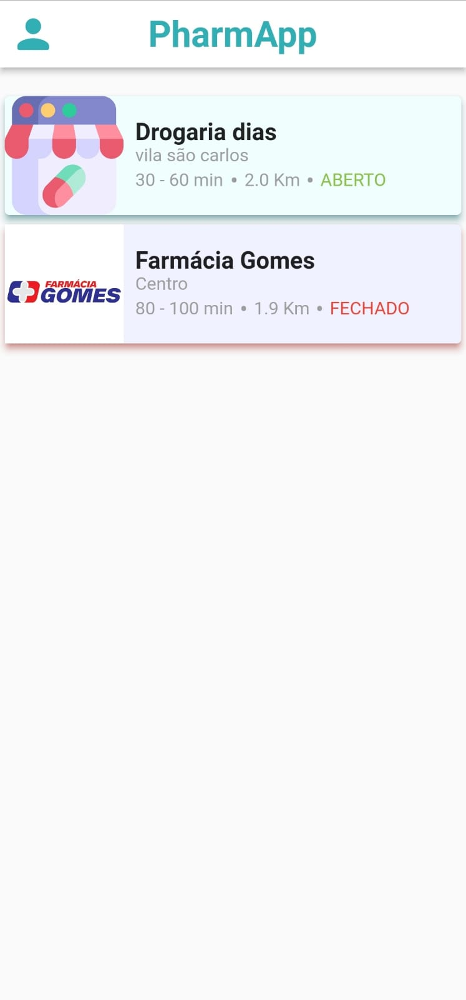
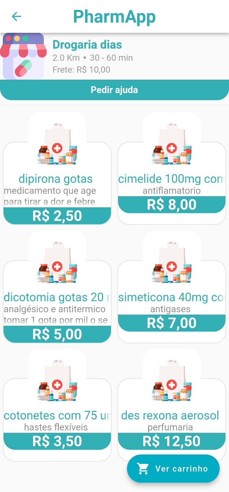
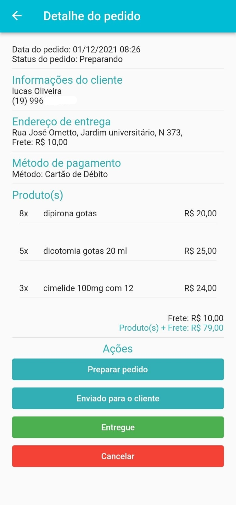
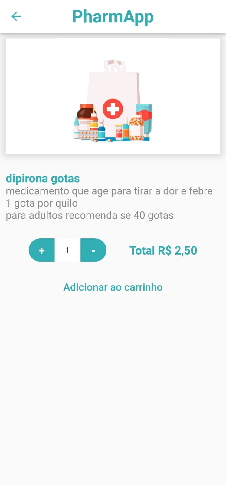

# PharmApp

> O aplicativo tem duas partes a primeira possibilita que o usuário possa comprar produtos de farmacias, cadastra endereço e realizar pedidos, a segunda parte seria a possibilidade da farmacia poder cadastrar seus produtos, gerenciar pedidos e cadastrar farmaceuticos. O projeto utiliza API em NodeJs para realizar a conexão com o bnaco de dados e PostgreSql para o armazenamento de dados.

### Possíveis melhorias

- [ ] Separar os módulos de Usuário e Farmacia
- [ ] Aplicar sistema de Cupons
- [ ] Permitir que o usuário possar definir a sua localidade
- [ ] Possibilitar a Farmacia a limitação de distancia de entrega
- [ ] Sistema de comentário
- [ ] Sistema de nota

## 💻 Pré-requisitos

Antes de começar, verifique se você atende aos seguintes requisitos:
* `VsCode ou Android` instalados;
* `Flutter e Dart` instalados;
* `PostgreSQL >13` instalado;
* `NodeJs` instalado;
* <a href="https://github.com/mathtgm/API_PharmApp">`API PharmApp`</a> baixada;

## ☕ Utilizando o aplicativo

Para usar o aplicativo, siga estas etapas:

1º Crie um Database no PostgreSQL com o nome "app_farmacia" após criar restaure o backup do banco que está na pasta raiz do aplicativo com o nome "bancoVazio.backup";
Restaurar o banco:
```
pg_restore -h endereçoDaMaquina -p 5432 -U postgres -d nomeDoBanco -v "diretórioDoArquivoDeBackup"
```
2º Edite o arquivo "index.controllers.js" presente na API no caminho "API_PharmApp/controllers/" com as informações de acesso ao banco de dados;

3º Vá para o diretório raiz da API e inicie o arquivo "server.js"

```
node server.js
```
Obs: Após executar o comando será apresentado uma mensagem de sucesso como "Servidor iniciado!".

4º Edite o arquivo "database.dart" que se encontra no diretório app_pharm/lib/app/data com o IP da máquina aonde se encontra a API;

5º Execute o aplicativo;

## 🖼️ Imagens do aplicativo

Aqui está algumas imagens do aplciativo, se quiser ver mais todas as imagens estão na pasta "imagens":

<table>
  <tr>
    <td align="center">
        <br>
        <sub>
          <b>Lista de famacias próximas ao usuário</b>
        </sub>
    </td>
    <td align="center">
      <br>
        <sub>
          <b>Lista de produtos da farmacia</b>
        </sub>
    </td>
    <td align="center">
        <br>
        <sub>
          <b>Tela de gerenciamento de pedido da farmacia</b>
        </sub>
    </td>
    <td align="center">
      <br>
        <sub>
          <b>Informações do produto</b>
        </sub>
    </td>
  </tr>
</table>
